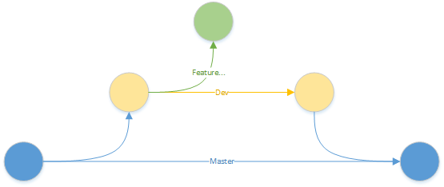
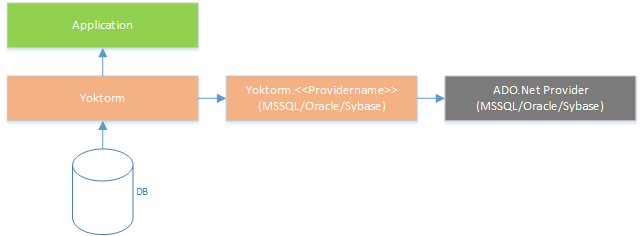

# About yoktorm

Yoktorm is a compiler-as-a-service supported .net ORM, which aim is to be lightweight, dynamic and fast. The name is a combination of [yocto](https://en.wikipedia.org/wiki/Yocto-) and [ORM](https://en.wikipedia.org/wiki/Object-relational_mapping).

## Wiki / Information

Detailed information about yoktorm are available in the [wiki](https://github.com/simplic-systems/yoktorm/wiki).

# Setup development environment

 1. Clone the project.
 2. Open the `Yorktorm.sln` solution file in the `/src/` directory.
 3. Compile.

# Contribute to the project

Larger contributions need an issue and an [YPF](https://github.com/simplic-systems/yoktorm/wiki). Smaller contributions can be done via pull request.

All pull request must be done to `dev`, because the `dev` branch always contains the current *stable* development version. The `master` branch contains the last realsed version. 

# Architecture

The yoktorm core is implemented in a single assembly. Any database managementsystem needs its own yoktorm-provider. This provider delivers information about the internal database structure and its techniques. E.g. for querying the table structure.

## Detailed structure

* Application: Application that uses yoktorm
* DataContext: Executes database operations and holds a database connection
* ObjectStateManager: Holds the state of an object loaded ord created using the datacontext

# About the contributor and creator

The project is initially created by [SIMPLIC GmbH](https://simplic.biz) and is heavily used in all SIMPLIC products.

| Type | Name | Projects |
| --- | --- | --- |
| Creator | [SIMPLIC GmbH](https://simplic.biz) | The complete SIMPLIC product family |
